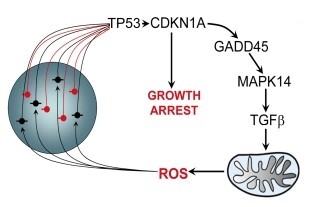

# An Educational App for the ROS-DDR Senescence Feedback Loop

Senescence, the irreversible state in which a cell ceases to grow and divide, is often the consequence of 
excessive reactive oxygen species (ROS) accumulation. ROS tends to cause DNA damage, but elevated levels of DNA 
damage response (DDR) foci, in turn, result in increased ROS production. This app is designed to help one 
understand this feedback loop and the proteins involved (specifically p21, p38, and p53) and how they decide a 
cell's fate between senescence, DNA damage, or apoptosis.

The *in silico* model and the diagram below are adapted from the paper [Feedback between p21 and reactive oxygen production is necessary for cell senescence](https://nanohub.org/tools/create) by Passos et al..

### Figure 3A
